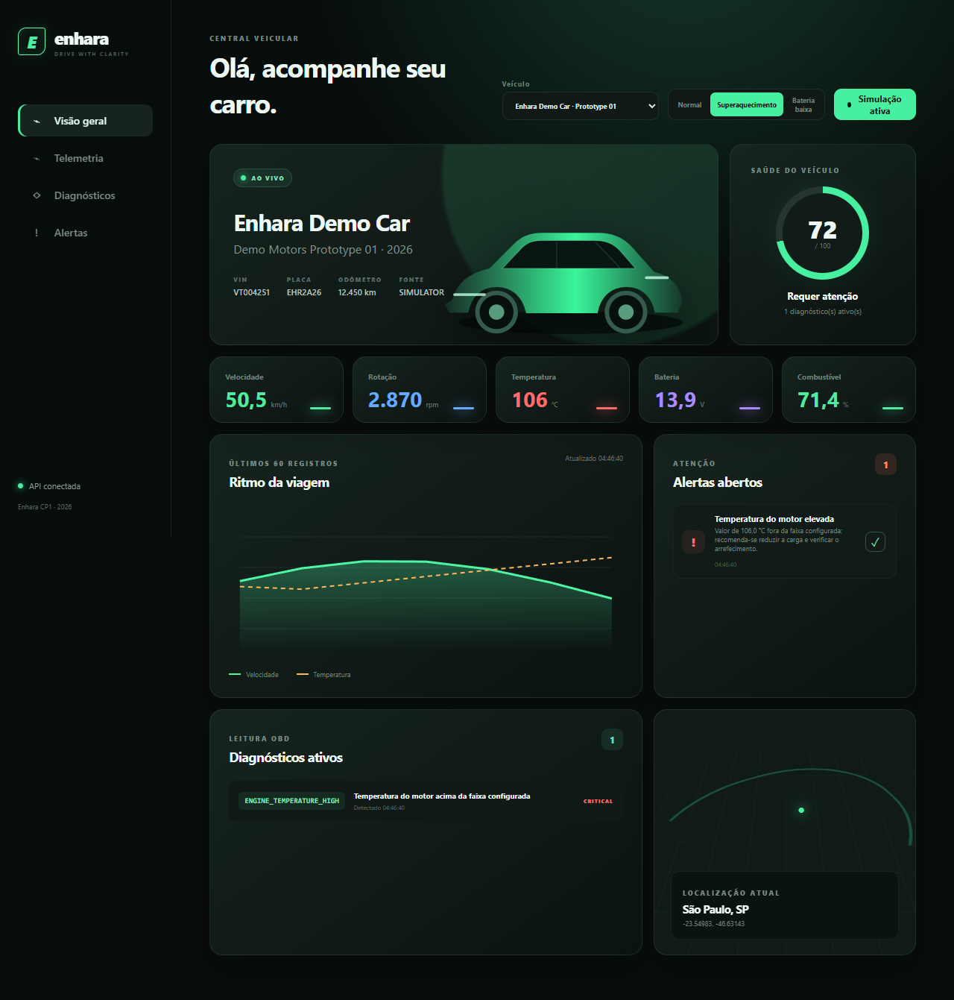

# Enhara

MVP local de assistência veicular conectada. Uma ECU simulada no aplicativo móvel produz telemetria, a API persiste as leituras, executa regras determinísticas, cria alertas deduplicados e transmite atualizações via SSE para o dashboard.

## Problema e solução

Dados automotivos brutos são difíceis de interpretar e falhas percebidas tarde aumentam risco e custo. O Enhara converte leituras em orientações preventivas, com regras explicáveis e linguagem assistiva que não afirma causalidade não comprovada. No CP1, o mesmo contrato previsto para OBD-II é exercitado por um simulador reproduzível.

## Corte vertical entregue

```text
React Native / simulador ECU
        │ lotes HTTP
        ▼
Spring Boot ── Flyway/JPA ── PostgreSQL
        │          │
        │          └─ diagnósticos + alertas persistidos
        ▼
       SSE ──────────────────► React Dashboard
```



- Veículos: cadastro, consulta e seed fictício no perfil de demonstração.
- Telemetria: ingestão unitária e em lote, latest, history, GPS, carga e acelerador.
- Diagnóstico: temperatura alta, bateria baixa e sobrerrotação; resolução automática.
- Alertas: persistência, deduplicação enquanto abertos e reconhecimento.
- Tempo real: eventos `telemetry`, `diagnostic`, `alert` e `alert-acknowledged` por veículo.
- Simulação: `NORMAL`, `OVERHEAT` e `LOW_BATTERY`, sem editar código.
- Web responsiva, mobile com `VehicleDataSource` desacoplado e contrato OpenAPI 3.1.

## Stack

- Java 21, Spring Boot 4, Maven, JPA, Validation, Security, Actuator, Modulith, Flyway e PostgreSQL 17.
- React, TypeScript, Vite e SSE no dashboard.
- React Native/Expo e TypeScript no aplicativo móvel.
- OpenAPI 3.1, JUnit 5, Vitest, Playwright, Docker Compose e GitHub Actions.

## Início rápido com Docker (PostgreSQL)

Pré-requisito para o caminho principal: Docker com Compose. Para execução separada, use Java 21, Node.js/npm e os wrappers/configurações versionados no repositório.

```bash
docker compose up --build
```

Abra:

- Dashboard: http://localhost:5173
- API/health: http://localhost:8080/actuator/health
- Swagger UI: http://localhost:8080/swagger-ui.html
- OpenAPI gerado: http://localhost:8080/v3/api-docs

O Compose inicia PostgreSQL 17, executa a migration Flyway, sobe a API e publica a interface por Nginx. Variáveis e valores de desenvolvimento estão em [.env.example](.env.example).

## Endpoints principais

- `GET /api/vehicles` e `GET /api/vehicles/{vehicleId}`
- `POST /api/telemetry/batches`
- `GET /api/vehicles/{vehicleId}/telemetry/latest|history`
- `GET /api/vehicles/{vehicleId}/dashboard`
- `GET /api/vehicles/{vehicleId}/diagnostics|alerts|events`
- `PATCH /api/alerts/{alertId}/acknowledge`
- `GET|POST /api/vehicles/{vehicleId}/simulation...`

O contrato completo, tipos, ranges, respostas de erro e unidades estão em [contracts/openapi.yaml](contracts/openapi.yaml).

## Demonstração sem Docker

O perfil `demo` usa H2 em memória no modo de compatibilidade PostgreSQL e cria um veículo fictício. É o plano B para computadores sem Docker/PostgreSQL:

```powershell
cd apps/backend
.\mvnw.cmd spring-boot:run "-Dspring-boot.run.profiles=demo"
```

Em outro terminal:

```powershell
cd apps/web
npm ci
npm run dev
```

Selecione “Superaquecimento” no dashboard; o cenário também inicia o simulador. Em cerca de 12 segundos a temperatura ultrapassa 105 °C, a regra abre diagnóstico e alerta e ambos chegam por SSE. Para uma execução determinística e rápida:

```powershell
.\scripts\demo-flow.ps1
```

## Aplicativo móvel

```powershell
cd apps/mobile
npm ci
$env:EXPO_PUBLIC_API_URL='http://SEU-IP-LAN:8080'
npm start
```

No emulador Android, o padrão é `http://10.0.2.2:8080`; iOS/web usam `localhost`. O botão da ECU local começa a produzir uma amostra por segundo. A fila sincroniza ao alcançar cinco amostras ou a cada quatro segundos. A classe `BluetoothVehicleDataSource` documenta o limite do MVP sem simular uma integração de hardware que ainda não existe.

## Verificações

```powershell
cd apps/backend
.\mvnw.cmd test
.\mvnw.cmd package

cd ..\web
npm test
npm run build

cd ..\mobile
npm run typecheck
npx expo export --platform android --output-dir dist

cd ..\..
npx --yes @redocly/cli lint contracts/openapi.yaml
```

## Estrutura

- `apps/backend` — monólito modular Spring Boot, migrations e testes.
- `apps/web` — dashboard React/Vite e testes Vitest.
- `apps/mobile` — app Expo/React Native, mock ECU e batching.
- `packages/shared-types` — tipos compartilhados entre web e mobile.
- `packages/api-client` — cliente HTTP reutilizável pelo dashboard.
- `contracts/openapi.yaml` — contrato versionado da API.
- `docs` — arquitetura, ADRs e roteiro do CP1.
- `scripts` — automação e fallback da apresentação.

## Estado atual, limites e roadmap

O núcleo do CP1 está funcional no perfil local de demonstração e foi exercitado no navegador: veículo → cenário normal → telemetria persistida → `OVERHEAT` → diagnóstico → alerta → SSE. A matriz detalhada está em [acceptance.md](docs/cp1/acceptance.md).

- Autenticação está aberta no ambiente do MVP, embora o filtro Spring Security esteja configurado; identidade, autorização e gestão de usuários são trabalho posterior.
- Bluetooth/ELM327 real exige dispositivo, permissões nativas e validação em hardware.
- Trips e mapa completo ficaram fora do corte para preservar o fluxo telemetria → diagnóstico → alerta.
- Testcontainers está configurado, mas a suíte padrão usa H2 para funcionar sem Docker. A execução PostgreSQL é fornecida pelo Compose.

O roadmap prioriza validação PostgreSQL em Docker, OBD-II/Bluetooth real, GPS/trips e autenticação antes de push, frotas ou analytics. Veja [arquitetura](docs/architecture/architecture.md), [roteiro da apresentação](docs/cp1/demo-script.md), [próximos passos](docs/cp1/next-steps.md) e [status dos critérios](docs/cp1/acceptance.md).
