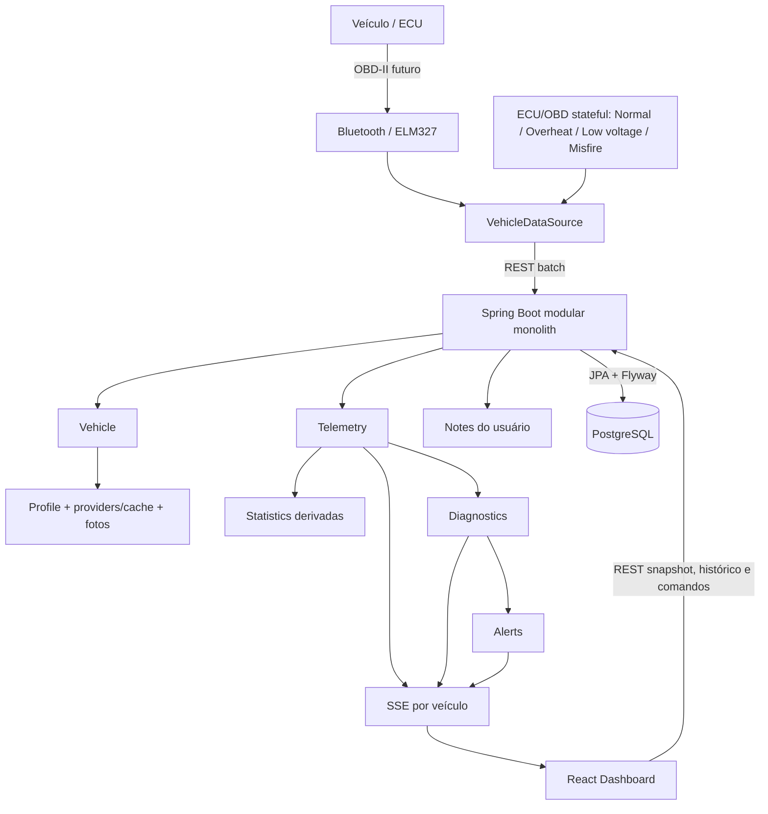

# Arquitetura do Enhara CP1

## Contexto e componentes

O CP1 transforma telemetria veicular simulada em diagnóstico preventivo explicável. O app mobile coleta pela porta `VehicleDataSource` e envia lotes REST. O monólito modular Spring Boot valida e persiste amostras, executa regras determinísticas, mantém diagnósticos e alertas e publica mudanças por SSE. PostgreSQL guarda o histórico e o dashboard React combina snapshot REST com atualizações ao vivo.

## Responsabilidades e fluxo

- **Mobile/ECU:** executa um veículo stateful por perfil (condutor → dinâmica → transmissão/motor → ECU → OBD), produz uma leitura por segundo e sincroniza a fila em lotes. Ao encerrar a coleta, drena a fila antes de finalizar a viagem; se a API falhar, preserva as amostras e mantém a viagem aberta. A tela não depende da implementação simulada.
- **Vehicle:** registra identidade e metadados não sensíveis; VIN é opcional e o perfil pode ser corrigido manualmente.
- **Vehicle Profile:** combina cadastro persistido, VIN de OBD real quando existir, BrasilAPI/FIPE, NHTSA vPIC, correções e fotos do usuário; leitura do perfil não chama providers. Detalhes e decisões estão em [vehicle-profile.md](vehicle-profile.md).
- **Telemetry:** impõe limites de lote e histórico, persiste números com unidades explícitas e coordena o caso de uso principal.
- **Diagnostics:** executa regras centralizadas, ativa condições e as resolve quando as leituras voltam ao normal.
- **Alerts:** abre uma ocorrência enquanto não existir alerta equivalente aberto, permite consulta e reconhecimento.
- **Realtime:** mantém emitters SSE por veículo, publica eventos somente após o commit da transação correspondente e remove conexões em completion, timeout ou erro.
- **Dashboard:** carrega snapshot REST, mostra somente cards OBD permitidos pelas capabilities, distingue estado atual de último valor válido e aplica eventos incrementais sem polling agressivo.
- **Simulator:** declara capabilities por perfil e mantém live PIDs, DTCs pending/confirmed/permanent, MIL, freeze frame, readiness e Vehicle Information simulada. Esses DTCs não são findings nem alerts.
- **Statistics:** soma distância de viagens concluídas, consulta a máxima da telemetria persistida e mantém consumo indisponível enquanto não houver combustível consumido confiável.
- **Notes:** persiste conteúdo informado pelo usuário, com categoria, vencimento opcional e ciclo aberto/concluído; nunca é alimentado pelo simulador.

A persistência usa apenas migrations Flyway e Hibernate com `ddl-auto=validate`. O índice `(vehicle_id, recorded_at)` atende latest e history; `vehicle_notes` possui índices por veículo/data e veículo/status. A avaliação de amostra, diagnóstico e alerta acontece no mesmo processo para preservar consistência e simplicidade no CP1. As regras completas das duas telas estão em [dashboard-statistics.md](dashboard-statistics.md).

## Por que monólito modular

As features têm fronteiras de domínio visíveis, mas ainda compartilham uma transação e uma equipe. Separá-las em serviços agora adicionaria falhas distribuídas, consistência eventual e operação sem benefício demonstrado.

## Evolução plausível, não implementada

1. Monólito modular e PostgreSQL medidos em produção controlada.
2. Separação lógica de processamentos comprovadamente pesados.
3. Broker de eventos somente se volume e desacoplamento justificarem.
4. Kafka apenas para telemetria sustentada de alta escala.
5. Particionamento ou armazenamento especializado conforme retenção medida.
6. Extração de serviços somente por necessidade operacional ou organizacional concreta.
